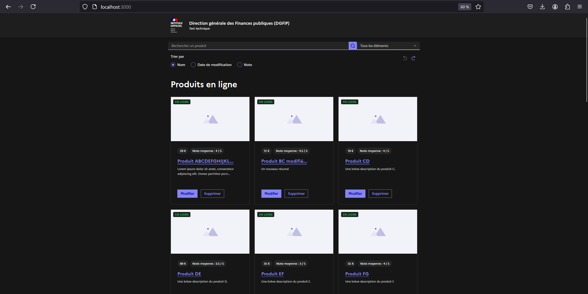
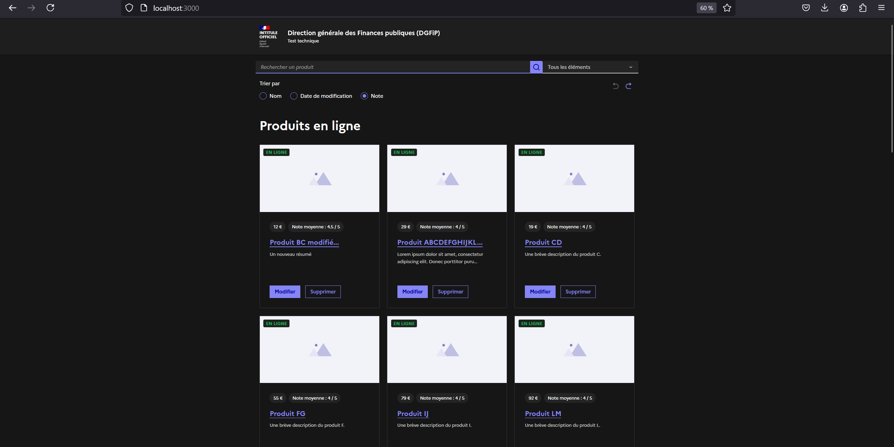
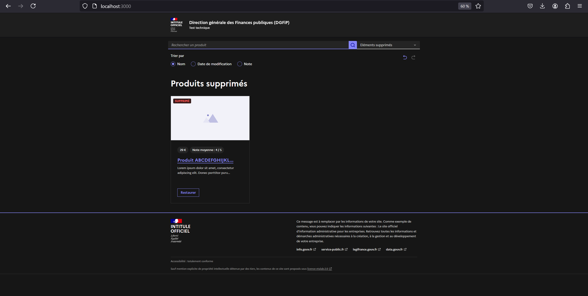
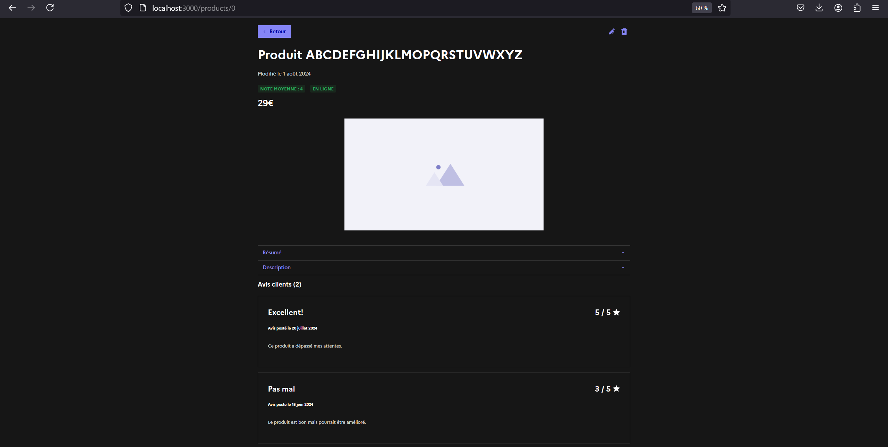
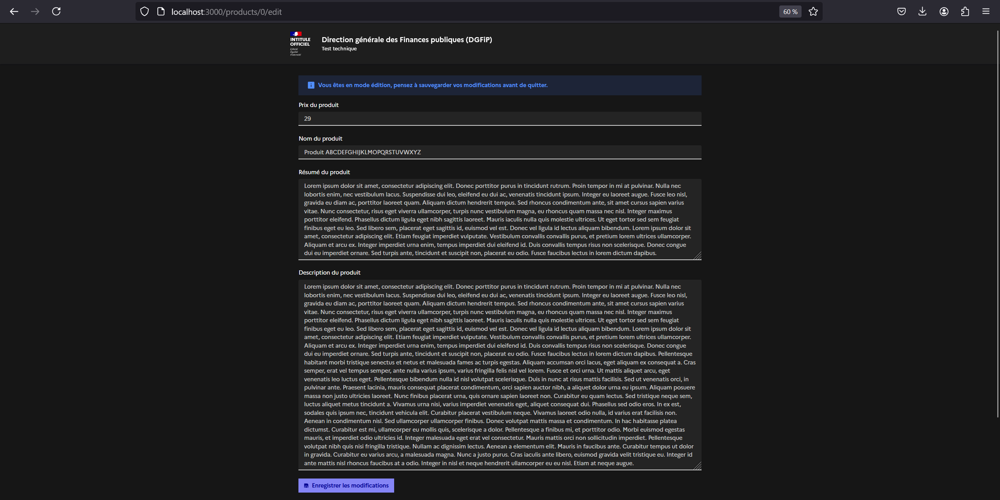
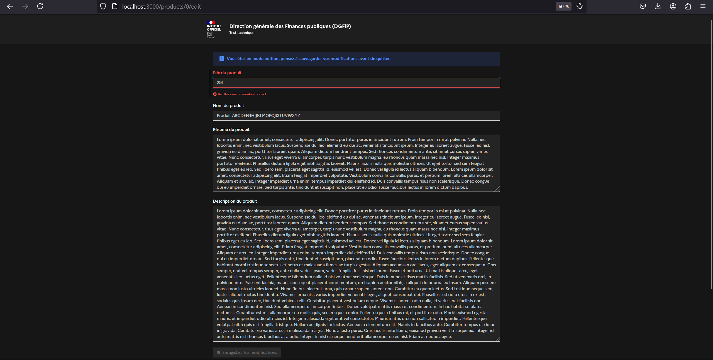

# 📦 Catalogue de produits

## 💻 Fonctionnalités

📷 Des illustrations sont disponibles en fin de documentation.

### 📄 Consultation de la liste des produits
- [x] Triée par défaut par nom, possibilité de trier par note et date de modification
- [x] Filtrée par défaut sur tous les produits, possibilité de filtrer par produit en ligne ou supprimé

### ℹ️ Consultation des informations relatives à un produit
- [x] Boutons de retour, de modification, de suppression
- [x] Informations disponibles : note, date de modification, nom du produit, résumé, description, avis

### ✏️ Modification des informations d’un produit
- [x] Depuis la page d'accueil avec redirection vers la page produit
- [x] Depuis la page produit

<br/>Le produit est modifié dans la base de données MongoDB.
<br/>⚠️ Les avis et notes laissés par les internautes ne peuvent pas être modifiés

### 🗑️ Suppression d’un produit du catalogue
- [x] Depuis la page d'accueil
- [x] Depuis la page produit avec redirection vers l'accueil

<br/>Le produit peut ensuite être restauré grâce au bouton "Restaurer" sur la carte produit ou grâce au bouton "Undo" / flèche retour. La suppression peut-être rejouée si annulée grâce au bouton "Redo". Le produit n'est jamais supprimé de la base de données afin de permettre la restauration.

## 💻 Installation

### 🔋 Stack

#### Frontend

##### 🧰 Général
- Next.js : pour le système de routing et la gestion du loading/d'erreurs
- TypeScript : pour assurer la robustesse de l'application
- React : pour générer des composants réutilisables
- DSFR : pour uniformiser et rendre accessibles les interfaces

##### 💅 Linting
- Eslint / prettier : pour formater les fichiers

#### Backend

##### 🧰 Général
- Python
- FastAPI : pour construire une API rapide
- MongoDB : pour stocker les produits

##### 💅 Linting
- Black pour : formater les fichiers
- Isort : pour organiser les imports
- Flake8 : pour vérifier que les conventions de style PEP 8 sont respectées

#### 🐋 Conteneurisation

- Docker : pour assurer la portabilité de l'application
- Docker-compose : pour la gestion multi-conteneurs

### ⚠️ Pré-requis
- docker et docker-compose
- python

### Commandes make

```bash
make install    # installation des dépendances du projet
make build      # construction des images Docker
make run        # lancement des conteneurs Docker
make test       # exécution des tests front/back
make format     # formatage des fichiers front/back
make clean      # nettoyage de l'environnement
```

## 🧪 Tests

- Frontend : tests end-to-end avec Cypress

```bash
cd web
pnpm run cypress:run
```

- Backend : tests des routes de l'API avec pytest

```bash
cd api
pytest
```

## Composition de l'app

### Front-end

#### Organisation

L'application est composée comme suit :
- fichiers de configuration et Dockerfile à la racine
- dossier app/ comprenant :
    - les composants réutilisables
    - les interfaces
    - un dossier utils
    - un dossier hooks comprenant des hooks personnalisés
    - un dossier constants notamment pour lister les différents endpoints à appeler
    - un dossier products/ qui comporte les différentes pages de l'application

#### Accès

Le front-end écoute sur le __port 3000__ et peut être lancé dans le dossier web/ avec la commande :

```bash
pnpm install
pnpm run dev
```

Le routage repose sur Next.js ce qui permet d'accéder facilement :

```bash
# liste des produits
http://localhost:3000/

# page d'un produit particulier
http://localhost:3000/products/{productId}

# page de modification d'un produit
http://localhost:3000/products/{productId}/edit
```

### Back-end

#### Organisation

L'application est composée comme suit :
- fichier d'installation des dépendances (requirements.txt) et Dockerfile à la racine
- dossier app/ comprenant :
    - le main permettant de lancer l'app et de définir le partage des ressources entre origines multiples (CORS)
    - un dossier crud qui définit la logique de chaque route
    - un dossier models qui définit le modèle Product utilisé
    - un dossier routes qui définit les routes de l'API
    - dossier db comprenant le fichier de produits fictifs (product.json) utilisé pour donner des exemples de produits à insérer dans la base de données ainsi qu'un .env.example. Le fichier insert_products.py permet de reset la base de données.
- dossier pyetst-rest-api composé des tests des différentes routes

⚠️ Les produits en ligne et supprimés se distinguent grâce à un boolean "is_deleted". Les fiches produit ont été rédigées par chatGPT

#### Accès

⚠️ Le fichier /api/app/db/.env.example doit être renommé. Les valeurs <username> et <password> doivent être modifiées pour accéder à la base de données.

```bash
mv api/app/db/.env.example .env
```

Le back-end écoute sur le __port 8000__ et peut être lancé dans le dossier api/app/ avec la commande :

```bash
fastapi dev main.py
```

📄 Un swagger est accessible à l'adresse :
```bash
http://localhost:8000/docs
```

Les routes sont les suivantes :

```bash

#   GET

#   liste des produits
#    retourne les produits (disponibles et supprimés) et les produits restaurés
http://localhost:8000/api/products

#   liste des produits composés dans leur title du product_name spécifié
#    retourne les produits (disponibles et supprimés) et les produits restaurés
#   si le champs est vide, tous les produits sont retournés
http://localhost:8000/api/search_by_name/?product_name={productName}

#   liste des produits triés par date
#    retourne les produits (disponibles et supprimés) et les produits restaurés
http://localhost:8000/api/products/sort_by_date

#   liste des produits triés par note
#    retourne les produits (disponibles et supprimés) et les produits restaurés
http://localhost:8000/api/products/sort_by_rate

#   liste des produits triés par nom
#    retourne les produits (disponibles et supprimés) et les produits restaurés
http://localhost:8000/api/products/sort_by_name

#   produit particulier identifié par son id
http://localhost:8000/api/products/{productId}

#   POST

#   restaure un produit identifié par son product_id
#   retourne les produits (disponibles et supprimés) et les produits restaurés
http://localhost:8000/api/restore_product

#   suppression du dernier produit restauré
#   retourne les produits (disponibles et supprimés) et les produits restaurés
http://localhost:8000/api/redo_product

#   PUT

#   modification d'un produit identifié par son id
#   retourne le produit modifié
http://localhost:8000/api/products/{productId}

#   DELETE

#   suppression d'un produit identifié par son id
#   retourne les produits (disponibles et supprimés)
http://localhost:8000/api/delete_product/{productId}
```

### 📷 Illustrations

#### 📄 Liste des produits

- Triés par noms (1) puis par notes (2)
<p align="center">
	
</p>
<p align="center">
	
</p>

- Filtrés par produits supprimés
<p align="center">
	
</p>

#### ℹ️ Fiche produit

- En mode lecture
<p align="center">
	
</p>

- En mode édition sans erreur (1) puis avec une erreur dans le prix (2)
<p align="center">
	
</p>
<p align="center">
	
</p>

### Ressources

- [Tutoriel NextJS 13 en 1 HEURE | Apprendre l'ESSENTIEL en 2024](https://www.youtube.com/watch?v=c6yk8apme_c&t=1092s)
- [Cypress docs](https://docs.cypress.io/guides/end-to-end-testing/writing-your-first-end-to-end-test)
- [Mocking API Response In Cypress](https://kailash-pathak.medium.com/mocking-api-response-in-cypress-a73dea514cfd)
